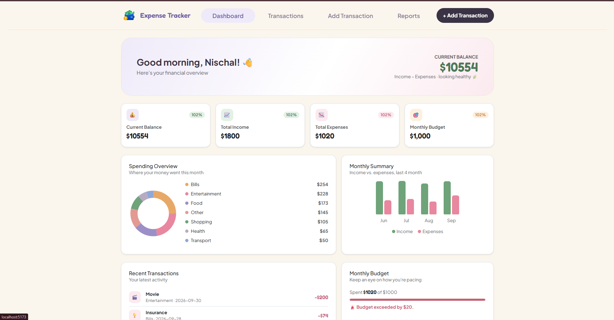
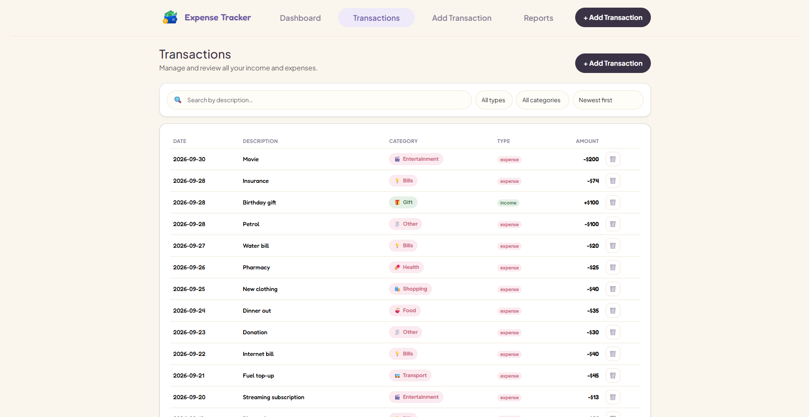
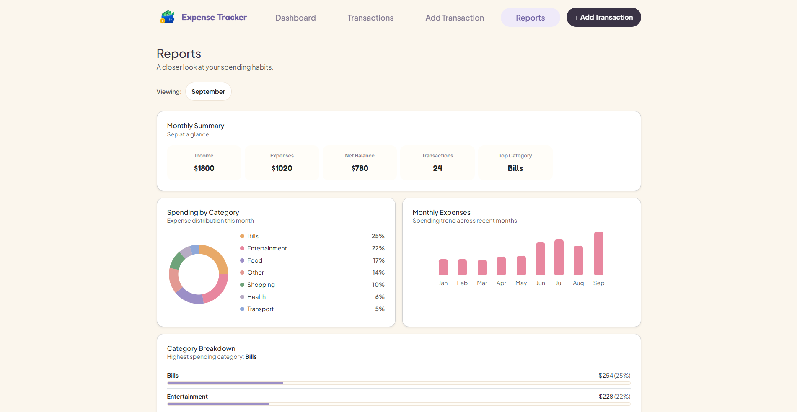

# Personal Expense Tracker — ExpenseFlow


## 🚀 Live Demo

**[View ExpenseFlow Live](https://expense-tracker-1w6k.vercel.app)**

## Project Description

**ExpenseFlow** is a React-based personal expense tracking application designed to help users record, organize, and understand their income and expenses. The application provides a dashboard, transaction management, transaction entry form, and monthly financial reports to make personal financial tracking simple and organized.

---

## Features

The following features have been implemented in the application:

* **Dashboard**

  * Displays current balance, total income, and total expenses.
  * Provides an overview of recent financial activity.
  * Displays monthly financial information.
  * Shows spending and income statistics.

* **Transaction Management**

  * Displays recorded income and expense transactions.
  * Shows transaction type, category, description, date, and amount.
  * Allows users to view and filter transaction information.

* **Add Transaction**

  * Allows users to add new income or expense transactions.
  * Supports different income and expense categories.
  * Includes transaction date, amount, category, and description fields.
  * Includes form validation.
  * Displays validation feedback for invalid or incomplete input.

* **Reports**

  * Provides monthly financial summaries.
  * Displays total income and expenses for the selected month.
  * Calculates net balance.
  * Displays transaction count.
  * Identifies the highest spending category.
  * Shows spending by category.
  * Displays monthly expense trends.
  * Provides category-wise spending breakdown.

* **Navigation**

  * Client-side navigation using React Router.
  * Separate routes for Dashboard, Transactions, Add Transaction, and Reports.
  * Shared navigation/header across application pages.

* **Data Management**

  * Uses JSON data for predefined transactions and categories.
  * Supports different expense categories such as Food, Transport, Shopping, Entertainment, Bills, Health, Education, and Other.
  * Supports income categories such as Salary, Freelance, Business, Gift, and Other.

* **User Interface**

  * Responsive layout for different screen sizes.
  * Clean and simple financial dashboard design.
  * Custom CSS styling for application components.
  * Uses Bootstrap utility and layout classes.
  * Includes application branding and logo.

---

## Technologies and Libraries Used

### Frontend

* **React 19**
* **JavaScript (JSX)**
* **Vite**
* **React Router DOM**
* **HTML5**
* **CSS3**
* **Bootstrap**
* **JSON**

### Libraries

* **React Router DOM** — Used for client-side routing and navigation.
* **SweetAlert2** — Used for user-friendly alert and notification messages.

### Development Tools

* **Node.js**
* **npm**
* **Visual Studio Code**
* **Git / GitHub**

---

## Project Structure

```text
personal-expense-tracker/
│
├── public/
│
├── src/
│   ├── assets/
│   │   └── images/
│   │       └── logo.png
│   │
│   ├── components/
│   │   ├── Header.jsx
│   │   ├── Header.css
│   │   └── Sidebar.jsx
│   │
│   ├── data/
│   │   └── expenses.json
│   │
│   ├── pages/
│   │   ├── AddTransactions.jsx
│   │   ├── AddTransaction.css
│   │   ├── Dashboard.jsx
│   │   ├── Dashboard.css
│   │   ├── Layout.jsx
│   │   ├── Reports.jsx
│   │   ├── Report.css
│   │   ├── Transactions.jsx
│   │   └── Transaction.css
│   │
│   ├── App.jsx
│   ├── main.jsx
│   └── MyRoute.jsx
│
├── index.html
├── package.json
├── package-lock.json
├── vite.config.js
├── eslint.config.js
└── README.md
```

---

## Application Routes

| Page            | Route              |
| --------------- | ------------------ |
| Dashboard       | `/dashboard`       |
| Transactions    | `/transactions`    |
| Add Transaction | `/add-transaction` |
| Reports         | `/reports`         |

---

## Setup Instructions

### 1. Prerequisites

Make sure the following are installed on your computer:

* **Node.js**
* **npm**
* A code editor such as **Visual Studio Code**

You can verify Node.js and npm installation using:

```bash
node -v
npm -v
```

---

### 2. Clone or Download the Project

If the project is available on GitHub, clone the repository:

```bash
git clone <your-github-repository-url>
```

Then move into the project directory:

```bash
cd personal-expense-tracker
```

If you downloaded the project as a ZIP file, extract it and open the project folder in Visual Studio Code.

---

### 3. Install Dependencies

Open a terminal in the project root directory and run:

```bash
npm install
```

This installs all dependencies listed in `package.json`.

---

### 4. Start the Development Server

Run:

```bash
npm run dev
```

Vite will start the development server.

The terminal will provide a local URL similar to:

```text
http://localhost:5173/
```

Open the provided URL in your web browser.

---

### 5. Build the Project

To create a production build, run:

```bash
npm run build
```

To preview the production build locally:

```bash
npm run preview
```

---

## Screenshots

The following screenshots demonstrate the main interfaces of the application.

### 1. Dashboard




---
### 2. Transactions



---

### 3. Reports




> **Note:** Create a `screenshots` folder in the project root and place your screenshots inside it using the following names:
>
> * `dashboard.png`
> * `transactions.png`
> * `reports.png`

Example:

```text
personal-expense-tracker/
│
├── screenshots/
│   ├── dashboard.png
│   ├── transactions.png
│   └── reports.png
│
├── src/
├── package.json
└── README.md
```

---

## Data Source

The application currently uses a local JSON file for its initial application data:

```text
src/data/expenses.json
```

The JSON file contains:

* Application information
* Expense categories
* Income categories
* Monthly budget
* Monthly summaries
* Transaction records

Example categories include:

**Expenses**

* Food
* Transport
* Shopping
* Entertainment
* Bills
* Health
* Education
* Other

**Income**

* Salary
* Freelance
* Business
* Gift
* Other

---

## Known Limitations

The following limitations remain in the current version of the project:

* The application does not currently use a backend server or database.
* Transaction data is primarily based on local JSON/application state.
* There is no user authentication or account management system.
* The application does not provide cloud synchronization between devices.
* Advanced financial features such as recurring transactions, financial goals, and automated budgeting are not implemented.
* The reporting functionality is based on the transaction data available within the application.
* Production deployment and backend integration may require additional configuration.

---

## Future Improvements

Possible future improvements include:

* Add a backend API.
* Connect the application to a database.
* Add user authentication and registration.
* Add persistent cloud-based transaction storage.
* Add edit and delete transaction functionality.
* Add advanced filtering and searching.
* Add export functionality for CSV/PDF reports.
* Add recurring income and expense transactions.
* Add customizable monthly budgets.
* Add financial goals and savings tracking.
* Add more advanced charts and analytics.
* Improve accessibility and mobile responsiveness.

---

## Author

**Personal Expense Tracker — ExpenseFlow**

Built as a React frontend project for learning and demonstrating modern web development concepts including React components, routing, state management, JSON data handling, form validation, responsive UI design, and financial data visualization.
